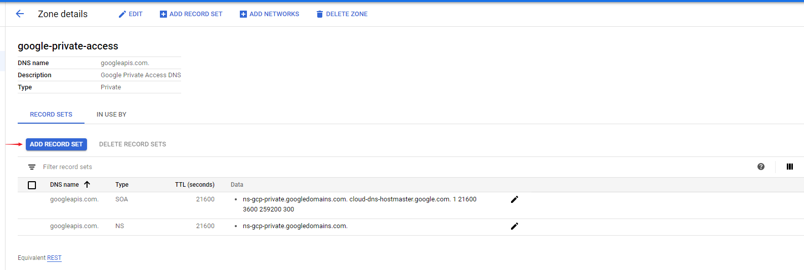
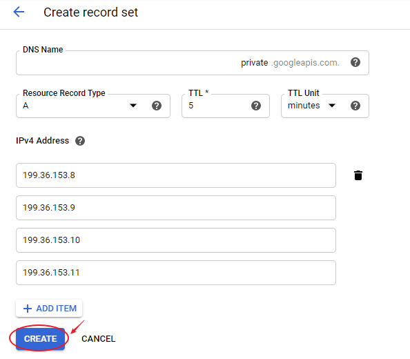

# Configuring Private Google Access for on-premises hosts

<!-- MarkdownTOC autolink=true -->

- [Documentation](#documentation)
- [Creating DNS records](#creating-dns-records)
- [DNS Forwarding](#dns-forwarding)
- [VPC network routing](#vpc-network-routing)
- [On-premises routing with Cloud Router](#on-premises-routing-with-cloud-router)
- [Firewall considerations](#firewall-considerations)
- [What's Next?](#whats-next)

<!-- /MarkdownTOC -->

## Documentation

https://cloud.google.com/vpc/docs/configure-private-google-access-hybrid#gcloud
https://cloud.google.com/dns/docs/policies#list-in-entrypoints
https://cloud.google.com/dns/docs/policies#create-in
https://cloud.google.com/vpc/docs/configure-private-google-access

## Creating DNS records

Your on-premises network must have DNS zones and records configured so that Google domain names resolve to the set of IP addresses for either private.googleapis.com or restricted.googleapis.com. You can create Cloud DNS managed private zones and use a Cloud DNS inbound server policy, or you can configure on-premises name servers. For example, you can use BIND or Microsoft Active Directory DNS.

1. Create a DNS zone and records for *.googleapis.com

```bash
gcloud dns managed-zones create private-google-access \
    --description="Private Google Access DNS" \
    --dns-name=googleapis.com \
    --networks=support-private-vpc \
    --visibility=private
```

2. In the googleapis.com zone, create one of the following A records, depending on the chosen domain:

- 'A' record for private.googleapis.com pointing to the following IP addresses: 199.36.153.8, 199.36.153.9, 199.36.153.10, 199.36.153.11





- Check if it works: (Linux VM in the same VPC network)

```bash
dig *.googleapis.com
```

## DNS Forwarding

If you've implemented the DNS configuration using Cloud DNS, you'll need to configure on-premises systems so that they can make queries to your Cloud DNS managed private zones:

1. Create an inbound server policy in the VPC network to which your on-premises network connects.

```bash
gcloud dns policies create [name] \
    --description=[description] \
    --networks=[vpc-network-list] \
    --enable-inbound-forwarding
```

Replace the following command options:

- **name**: A name for the policy
- **description**: A description for the policy
- **vpc-network-list**: A comma-delimited list of VPC networks where inbound forwarding addresses must be created

2. Identify the inbound forwarder entry points, in the region(s) where your Cloud VPN tunnels and Cloud Interconnect attachments (VLANs) are located, in the VPC network to which your on-premises network connects.

```bash
gcloud compute addresses list \
    --filter='purpose = "DNS_RESOLVER"' \
    --format='csv(address, region, subnetwork)'
```

3. Configure on-premises systems and on-premises DNS name servers to forward googleapis.com and any of the additional domain names to an inbound forwarder entry point in the same region as the Cloud VPN tunnel or Cloud Interconnect attachment (VLAN) that connects to the VPC network.

## VPC network routing

The VPC network to which your on-premises network connects must have routes for the IP address ranges used by private.googleapis.com or restricted.googleapis.com. These routes must use the default internet gateway next hop.

Google doesn't publish routes on the internet for the IP address ranges used by the private.googleapis.com or restricted.googleapis.com domains. Consequently, even though the routes in the VPC network send traffic to the default internet gateway next hop, packets sent to 199.36.153.8/30 and 199.36.153.4/30 remain within Google's network.

If the VPC network to which your on-premises network connects contains a default route whose next hop is the default internet gateway, that route meets the routing requirements for Private Google Access for on-premises hosts.

- VPC network custom routing

If you've replaced or changed your default route, ensure that you have custom static routes configured for the destination IP ranges used by private.googleapis.com or restricted.googleapis.com. To check the configuration of custom routes for Google APIs and services in a given network, follow these directions.

Use the following gcloud command, replacing [NETWORK_NAME] with the name of the VPC network to which your on-premises network connects:

```bash
gcloud compute routes list \
    --filter="default-internet-gateway [NETWORK_NAME]"
```

Routes are listed in table format unless you customize the command with the --format flag. Look in the DEST_RANGE column for a route whose destination range matches:

*199.36.153.8/30 if you chose private.googleapis.com*  
*199.36.153.4/30 if you chose restricted.googleapis.com*

Create the following route table in order the use the DNS records created before (if not created) replacing [NETWORK_NAME] with the name of the VPC network to which your on-premises network connects:
: 

```bash
gcloud compute routes create private-google-access --network [NETWORK_NAME] \
  --destination-range 199.36.153.8/30 \
  --next-hop-gateway=default-internet-gateway \
  --priority 100 \
  --description "Default route from Private Subnet to Private Google Access APIs"
```

## On-premises routing with Cloud Router

Routes in your on-premises network must be configured to direct traffic for the IP address ranges used by the private.googleapis.com or restricted.googleapis.com domains to the next hop Cloud VPN tunnels or Cloud Interconnect attachments (VLANs) that connect to your VPC network.

You can use Cloud Router Custom Route Advertisements to announce routes for the following destinations:

- 199.36.153.8/30 if you chose private.googleapis.com
- 199.36.153.4/30 if you chose restricted.googleapis.com

**Important:** IP address ranges for private.googleapis.com and restricted.googleapis.com are not routable on the internet. 

- To update the route advertisement mode for all BGP sessions on a Cloud Router, except for those BGP sessions that use custom BGP advertisements themselves:

1. Go to the Cloud Router page in the Google Cloud Console.
2. Select the Cloud Router that manages BGP sessions for the Cloud VPN tunnels or Cloud Interconnect attachments (VLANs) that connect your on-premises network to your VPC network.
3. In the Cloud Router's detail page, select Edit.
4. Expand the Advertised routes section.
5. For the Routes, select Create custom routes.
6. Select Advertise all subnets visible to the Cloud Router to advertise all subnet routes available to the Cloud Router if you desire the Cloud Router's default behavior.
7. Select Add custom route to add an advertised route.
8. Configure the route advertisement.
Source — Select Custom IP range to specify a custom IP range.
IP address range — Specify:

- 199.36.153.8/30 if you chose private.googleapis.com
- 199.36.153.4/30 if you chose restricted.googleapis.com

Description — Add a description.

9. After you're done adding routes, select Save.

- To update the route advertisement mode for a particular BGP session:

1. Go to the Cloud Router page in the Google Cloud Console.
2. Select the Cloud Router that manages the BGP session for a Cloud VPN tunnel or Cloud Interconnect attachment (VLAN) that connects your on-premises network to your VPC network.
3. In the Cloud Router's detail page, select the BGP session to update.
4. In the BGP session details page, click Edit.
5. For the Routes, select Create custom routes.
6. Select Advertise all subnets visible to the Cloud Router to advertise all subnet routes available to the Cloud Router if you desire the Cloud Router's default behavior.
7. Select Add custom route to add an advertised route.
8. Configure the route advertisement.
Source — Select Custom IP range to specify a custom IP range.
IP address range — Specify:

- 199.36.153.8/30 if you chose private.googleapis.com
- 199.36.153.4/30 if you chose restricted.googleapis.com

Description — Add a description.

9. After you're done adding routes, select Save.

## Firewall considerations

Google Cloud firewall rules in the VPC network to which your on-premises network connects have no effect upon:

- Packets sent through a Cloud VPN tunnel connected to the VPC network
- Packets sent through a Cloud Interconnect attachment (VLAN) connected to the VPC network
- Incoming packets to Cloud DNS inbound forwarder IP addresses in the VPC network

You should ensure that the firewall configuration of on-premises systems allows outbound traffic to and established responses from:

- 199.36.153.8/30 if you use private.googleapis.com
- 199.36.153.4/30 if you use restricted.googleapis.com
- any Cloud DNS inbound forwarder IP addresses, if you're using Cloud DNS for the DNS configuration

## What's Next?

- See [Configuring Private Google Access for VPC](https://cloud.google.com/vpc/docs/configure-private-google-access) if you need VMs in your Google Cloud VPC network to access Google APIs and services.
- Enable VPC Flow Logs for troubleshooting.
